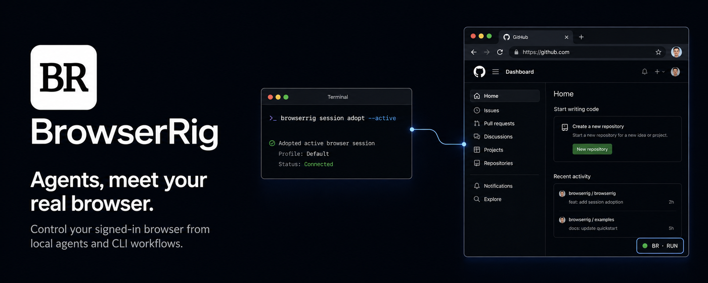

# BrowserRig

[English](README.md) | [简体中文](README.zh-CN.md)



BrowserRig 让可信的编程智能体在你现有的 Chromium 系浏览器中运行
Playwright。它直接使用你的真实浏览器配置，包括已经登录的会话和已安装的
扩展，而不是另外启动一个无头浏览器。

BrowserRig 是一个独立的开源产品，而不是其他浏览器智能体生态的授权中间层。
它衍生自采用 MIT 许可证的上游驱动，同时拥有自己的 CLI、npm 包、浏览器扩展
和商店身份。

## 为什么选择 BrowserRig

BrowserRig 专门填补浏览器自动化与个人日常浏览器之间那个棘手的空白：

- **使用你真实且已登录的浏览器。** 复用你已经在使用的 Chrome 窗口、Cookie、
  会话和扩展。
- **没有阻塞式远程调试授权。** BrowserRig 不连接 Chrome 的浏览器级远程调试
  端点，因此不会反复触发 **Allow remote debugging?** 对话框。
- **接管当前标签页无需点击工具栏。** `session adopt --active` 一条命令即可找到、
  附加并接管最近聚焦浏览器窗口中的当前标签页。
- **后台工作，不打断你的操作。** 普通的 `execute` 会在同一浏览器配置中创建后台
  标签页，而不是切换当前可见标签页或启动另一个浏览器。
- **完整的本地驱动，而不是智能体包装层。** 无需捆绑 LLM 或依赖托管服务，仍可
  使用 CLI、Playwright 执行会话、MCP 服务器、录制、网络捕获和人工接管。

### BrowserRig 与其他方案的比较

BrowserRig 将开源、CLI/Skill 优先的驱动方式，与对现有已登录浏览器的持久访问
结合在一起。下面的比较聚焦于这一核心工作流。

| 能力 | BrowserRig | Kimi WebBridge | agent-browser | Chrome DevTools MCP |
| --- | :---: | :---: | :---: | :---: |
| 开源核心 | ✅ | ❌ | ✅ | ✅ |
| CLI / Skill 优先 | ✅ | ✅ | ✅ | ❌<br><sub>MCP 优先；工具 Schema 会占用上下文</sub> |
| 无需再次浏览器授权即可重连已登录的 Chrome | ✅ | ✅ | ❌<br><sub>重连和浏览器重启后可能需要再次点击“Allow remote debugging?”</sub> | ❌<br><sub>每次自动连接都需要批准 Remote Debugging</sub> |

扩展仍然使用 Chrome 的 `debugger` API 传递 CDP 命令。差别在于传输方式和授权
范围：BrowserRig 使用扩展附加，而不是连接 Chrome 的浏览器级远程调试端点。
标签页被附加时，Chrome 可能会显示标准的非阻塞式调试提示条，但不需要逐个标签页
点击批准。

```text
智能体（DSH 插件、CLI 或 MCP）-> 本地中继 -> 浏览器扩展 -> 你的浏览器
```

驱动完全在本地运行，不包含 LLM，也不负责制定计划。它的主要接口是代码：智能体
发送一段 Playwright 代码，然后收到执行结果、日志、警告和变更摘要。

## 快速开始

BrowserRig 需要 Node.js 22.22.0 或更高版本，以及 Chrome、Brave、Edge、Arc
或 Chromium 等 Chromium 系浏览器。

设置分为两个必要部分：先把 BrowserRig 连接到你使用的智能体运行时，再安装浏览器
扩展。DeepSeek Harness 使用原生 DSH Bundle；其他编程智能体可以使用 CLI Skill
或 MCP 服务器。

### 1. 连接你的智能体

#### DeepSeek Harness

根目录的 `browserrig` 包遵循 DSH 的
[官方 Bundle 安装模型](https://deepseek-harness.github.io/deepseek-harness/develop/basic/publish)。
将它安装到你使用的 DSH Profile 中，然后检查组合后的配置层：

```bash
dsh plugin --profile web add browserrig
dsh --profile web --dump-config
```

这种方式既不需要全局安装 `browserrig` CLI，也不需要单独安装 BrowserRig Skill。
Bundle 自带与当前版本匹配的包内 CLI 运行时、六个类型化的 `browserrig_*` 工具和
简洁的操作指南。它为每个 DSH 智能体会话绑定一个持久的 BrowserRig 会话，无需
暴露 BrowserRig 会话 ID，也不要求模型记住这些 ID。

#### CLI 和 Skill 驱动的智能体

全局安装独立包：

```bash
npm install --global browserrig
```

这会为 CLI 和 Skill 驱动的智能体安装 `browserrig`，并为 MCP 客户端安装
`browserrig-mcp`。

包内 Skill 会教编程智能体如何先检查再操作、保持会话身份、处理只能由人完成的
步骤，以及从浏览器故障中恢复。使用 [skills CLI](https://skills.sh) 安装：

```bash
npx skills add Castor6/BrowserRig --skill browserrig -g
```

出现提示时选择你使用的智能体。全局 `-g` 安装可让 Skill 跨项目使用。

`Castor6/BrowserRig` 是 BrowserRig 的独立仓库身份。BrowserRig 不会自行修改
智能体配置。如需手动检查或安装 Skill，可以输出包中完全一致的文本：

```bash
browserrig skill
```

#### 可选的 MCP 服务器

Skill 和 MCP 服务器承担不同职责：Skill 教会智能体工作流程；MCP 将 BrowserRig
暴露为工具。能执行 Shell 命令的智能体只需要 Skill。当客户端更适合使用 MCP 工具
时，再添加 MCP。

OpenCode 配置：

```jsonc
// opencode.json
{
  "mcp": {
    "browserrig": {
      "type": "local",
      "command": ["browserrig-mcp"]
    }
  }
}
```

Claude Code 配置：

```bash
claude mcp add browserrig -- browserrig-mcp
```

CLI 和 MCP 客户端共用分离运行的中继，但每个执行会话都有自己的默认页面和持久
JavaScript `state`。重启 MCP 进程不会停止中继，也不会中断正在进行的 CLI 会话。

### 2. 安装扩展

[从 Chrome 应用商店安装 BrowserRig](https://chromewebstore.google.com/detail/browserrig/dbobcmjamjdknplkplgdihdnmdjklpin)，
然后可按需固定工具栏按钮，以便手动附加或分离标签页。每个新版本通过 Chrome
应用商店审核后，商店安装的扩展会自动更新。

如果需要进行源码开发，或当前浏览器无法使用该商店页面，可以改为加载包内的开发
版本：

1. 输出与你所选安装方式对应的扩展目录：

   ```bash
   # DeepSeek Harness profile (replace web if you use another profile)
   printf '%s\n' "${DSH_HOME:-$HOME/.dsh}/profiles/web/node_modules/browserrig/extension/dist"

   # Global npm installation
   printf '%s\n' "$(npm root --global)/browserrig/extension/dist"
   ```

2. 打开 `chrome://extensions`，或浏览器对应的页面，例如
   `brave://extensions`。
3. 启用 **开发者模式**。
4. 选择 **加载已解压的扩展程序**，然后选择上一步输出的目录。
5. 可选：固定 BrowserRig 工具栏按钮，以便手动附加或分离标签页。

### 3. 执行第一条浏览器命令

启动已配置的 DSH Profile，并让其中的智能体使用 BrowserRig：

```bash
dsh --profile web
```

如果直接安装了 CLI，可用下面的命令验证：

```bash
browserrig execute 'await page.goto("https://example.com"); return { title: await page.title(), url: page.url() }'
```

两种方式都会在需要时启动同一个分离运行的本地中继，并在现有浏览器配置中打开一个
后台标签页。直接调用 CLI 时，会输出易读的会话 ID 和继续该会话所需的完整
`--session` 命令；DSH 插件会在内部保持这种连续性。中继监听
`127.0.0.1:19990`，并在多次调用之间持续运行。

成功执行后会返回 `Example Domain` 标题、生成的会话 ID 和继续命令。随后
`browserrig status` 会报告扩展已经连接。

你可以随时检查安装状态：

```bash
browserrig doctor
browserrig status
```

`doctor` 和 `status` 都是只读命令。它们会报告中继已停止，但不会启动中继。
`browserrig serve` 只用于前台调试。

## 原生 DeepSeek Harness 集成

DSH Bundle 是 BrowserRig 之上的轻量原生适配器，而不是第二个浏览器驱动或 MCP
包装层。它直接向 DSH 提供以下工具：

- `browserrig_execute` 在 DSH 会话的持久页面中运行 Playwright JavaScript，
  并在可用时返回结构化值、日志、警告、执行后摘要和 DSH 图片附件。
- `browserrig_adopt_active` 直接接管用户当前已登录的标签页。
- `browserrig_status` 报告就绪状态，以及仅属于当前 DSH 会话的浏览器状态投影。
- `browserrig_reset` 重置当前会话，但不会关闭已接管的用户标签页。
- `browserrig_journal` 读取最近的 BrowserRig 执行历史。
- `browserrig_issue_report` 记录经过清理的 BrowserRig 产品或运行问题，且不暴露
  内部会话 ID。

每个 DSH 智能体会话都会持久映射到配置中继端点上的一个 BrowserRig 会话。首次
使用会以原子方式创建映射；如果明确确认 BrowserRig 会话不存在，则只替换一次，
同时保持其他 DSH 任务彼此隔离。内部 BrowserRig ID 和全局目标列表不会返回给
模型。

适配器使用固定参数数组、经过验证的 JSON 信封、有限输出和 DSH 取消机制，调用
同一个 npm 包中附带的 CLI。它不提供任意 Shell 或 CLI 透传，不依赖可能发生版本
漂移的独立全局可执行文件，环境中的 CLI 会话或目标选择器也无法覆盖 DSH 任务
绑定。它同样不会重复提供点击、填写和导航等微型工具层。直接使用 CLI、MCP 和库
的用户仍然独立于 DSH。

## TypeScript 客户端

对于需要发起结构化、浏览器认证请求，但不希望执行生成 JavaScript 的应用，此包
还导出了一个 Effect 客户端：

```bash
npm install browserrig effect@4.0.0-beta.97
```

```ts
import { BrowserRigClient } from "browserrig"
import { Effect, Schema } from "effect"

const program = Effect.gen(function* () {
  const client = yield* BrowserRigClient.make()
  const browserSession = yield* client.ensureSession({ id: "my-app" })
  const account = yield* browserSession.authenticatedOrigin({
    origin: "https://app.example.com",
    startUrl: "/account",
  })

  const sensitive = yield* account.json({
    path: "/api/session",
    method: "POST",
    body: {},
    response: Schema.Struct({ accessToken: Schema.String }),
    sensitive: true,
  })
  const credentials = BrowserRigClient.reveal(sensitive)

  const profile = yield* account.json({
    path: "/api/profile",
    response: Schema.Struct({ name: Schema.String }),
  })
  return { credentials, profile }
})
```

请求使用会话当前页面中的 `window.fetch`，因此浏览器中的 Cookie 会留在浏览器里。
路径必须同源，重定向会被阻止，响应有大小限制，变更请求不会自动重试。设置
`sensitive: true` 可接收 `Redacted<A>`；敏感请求会绕过执行日志，并在会话网络
捕获开启时被拒绝。使用 `BrowserRigClient.reveal` 解开敏感结果；这样即使应用和
BrowserRig 解析到了不同的 Effect 包实例，解包操作仍会发生在创建该脱敏值的同一个
Effect 运行时中。如果持久会话已不再连接，在创建新的认证来源能力之前，使用
`resetSession(id)` 替换该会话世代。

## 使用会话工作

不带参数的 `execute` 会创建一个新会话。传入它的 ID，即可继续使用同一页面和
`state`：

```bash
browserrig session new docs
browserrig execute --session docs 'await page.goto("https://example.com/docs"); state.visits = (state.visits ?? 0) + 1; return state.visits'
browserrig execute --session docs 'return { url: page.url(), visits: state.visits }'
browserrig journal --session docs
```

日志是尽力写入的本地活动记录，保存在
`~/.browserrig/sessions/<id>/journal.jsonl`。它包含有限长度的脚本和结果预览，
即使删除会话也会保留。不要直接在执行代码中嵌入密码、Token 或其他凭据。

单个表达式会自动返回，因此也可以使用更短的写法：

```bash
browserrig execute --session docs 'await page.title()'
```

较长的程序使用 `--file script.js`，需要机器可读的结果信封时使用 `--json`。
完成后删除会话：

```bash
browserrig session delete docs
```

## 控制现有标签页

中继创建的页面与其他 BrowserRig 会话相互隔离。要接管最近聚焦浏览器窗口中的
当前标签页，无需点击扩展，也无需匹配 URL：

```bash
browserrig session new github
browserrig session adopt --session github --active
browserrig execute --session github 'return { title: await page.title(), url: page.url() }'
```

`--active` 会在扩展内部解析并附加标签页，然后使用与现有已附加标签页相同的所有权
事务接管它。

如果你有意一次暴露多个标签页，或稍后选择一个非当前标签页，工具栏按钮仍然有用。
在这些标签页上点击工具栏按钮，然后通过 `--target-url` 或 `--target-index` 精确
选择其中一个：

```bash
browserrig session adopt --session github --target-url github.com
```

一个已接管目标只能属于一个 BrowserRig 会话。重置或删除会话时，会释放已接管的
用户标签页，而不会关闭它。

## 操作前先检查

执行代码可以使用标准的 Playwright `browser`、`context` 和 `page` 对象，以及
BrowserRig 辅助函数。交互前读取页面时，`snapshot()` 是精简的默认方式：

```bash
browserrig execute --session github 'return await snapshot()'
```

快照控件包含 `[ref=e12]` 这样的引用。下一次调用时可直接使用引用：

```bash
browserrig execute --session github 'await ref("e12").click(); return await snapshot({ diff: true })'
```

引用仅属于最新快照，并在页面导航后失效。它们同时结合结构身份和无障碍身份，因此
DOM 漂移时会安全失败，而不是悄悄指向另一个控件。

其他检查辅助函数包括：

- `ariaSnapshot()`：查看更深层的无障碍树
- `screenshotWithLabels()`：获取带标注的截图和元素元数据
- 当浏览器扩展干扰 Playwright 常规 `locator.fill()` 时，使用 `fillInput()` 和
  `fillInputs()`

原生 DSH Bundle 自带简洁的操作指南。对于直接使用 CLI 和 MCP 的智能体，包内
Skill 提供完整工作流和规范示例；命令的 `--help` 输出仍是详细选项的事实来源。

## 为只能由人完成的步骤暂停

遇到 CAPTCHA、2FA、付款确认或其他必须由人完成的步骤时，使用 `handoff()`：

```js
await handoff("Complete 2FA, then use the in-page continue control")
await page.getByRole("heading", { name: "Dashboard" }).waitFor()
return page.url()
```

如果点击操作本身可能阻塞在原生 WebAuthn 或付款界面上，请在触发它之前注册人工
接管：

```js
await handoff("Complete the security-key prompt, then continue", {
  timeoutMs: 600_000,
  start: () => page.getByRole("button", { name: "Use security key" }).click({ timeout: 600_000 }),
})
```

页面会显示一个无障碍的完成控件，脚本则等待用户操作。人工确认并不能证明所请求的
步骤已经成功，因此接管后始终要验证预期 URL 或元素。BrowserRig 会等待扩展确认
WAIT 状态后再调用 `start`。如果接管超时或目标先消失，它会在释放执行许可前断开
该沙箱的 Playwright 连接，防止仍未结束的提示操作稍后继续修改页面。`start` 中
只应包含用于打开原生提示的、有明确边界的浏览器操作。

## 使用只读会话

只读会话会拒绝鼠标和键盘 CDP 命令，但允许导航、检查和截图：

```bash
browserrig session new inspect --read-only
browserrig execute --session inspect 'await page.goto("https://example.com"); return await snapshot()'
```

只读模式可防止意外的 Playwright 输入，但它不是安全沙箱：可信代码仍然可以通过
`page.evaluate()` 修改页面。

## 录制会话

```bash
browserrig recording start ./demo.webm --session github
browserrig recording status --session github
browserrig recording stop --session github
```

自动模式对用户拥有的标签页优先使用浏览器标签页捕获，对中继创建的标签页使用 CDP
截屏流。只有用户在该标签页上调用扩展后，Chrome 才会授予标签页/音频捕获权限。
如果一个无需点击即可接管的标签页没有该授权，且未请求音频，自动模式会回退到 CDP。
显式使用 `--mode tab-capture` 和 `--audio` 仍需要点击一次工具栏；如果点击导致
已经受控的标签页分离，请在录制前再次运行 `session adopt --active`。标签页捕获
写入 WebM，并且可以包含音频。CDP 写入 WebM 或 MP4，需要 `PATH` 中存在
`ffmpeg`，会激活被录制的标签页，并且没有音频。

## 派生直接客户端

在工作流所需的任意多次执行调用或人工接管中捕获已认证 API 交换：

```bash
browserrig network start --session github --url /api/ \
  --resource-type fetch --resource-type xhr
browserrig execute --session github --file ./perform-flow.js
browserrig network stop --session github \
  --output ./github.har --secrets github
```

BrowserRig 自行记录规范化的请求/响应交换；HAR 是可互操作的导出格式，而不是内部
捕获模型。写出的产物会将 Cookie、Authorization Header、CSRF Token、API Key
以及查询或 Body 中类似 Token 的字段替换为稳定的 `${BROWSERRIG_SECRET_N}`
引用。无损值单独保存在 `~/.browserrig/secrets` 下、权限模式为 `0600` 的
Profile 中。无法可靠脱敏的 Body（包括二进制内容和包含文件的 multipart 内容）
会被省略并报告为截断。长度未知或经过压缩的响应 Body 也会被省略，确保 BrowserRig
不会在执行配置的预算限制前就将其完整加载到内存。

生成的客户端读取这些引用对应的环境变量，运行时不会打印或嵌入值：

```bash
browserrig secrets status github
browserrig secrets run github -- ./github-cli repositories
browserrig secrets refresh github --session github
```

`secrets refresh` 会重新加载会话页面，并在更新同一来源观察到的值时保留引用。
如果重新认证需要人工流程，请在浏览器中登录，并使用相同的 Profile 名称重复捕获。
BrowserRig 会先脱敏子进程的标准输出和标准错误，再将其返回。

## 报告 BrowserRig 问题

智能体可以记录由 BrowserRig 管理的运行问题，而无需在调用方仓库中写入待办事项或
跟踪文件：

```bash
browserrig issue report \
  --classification operational \
  --component relay \
  --summary "Relay recovered after a failed start" \
  --actual "The first start failed and the retry succeeded" \
  --error-code relay/start-failed \
  --recovery "Retried once"
```

CLI、MCP `issue_report` 和 DSH `browserrig_issue_report` 共用
`~/.browserrig/issues/` 下的同一个本地存储。报告会经过清理，以受限权限写入，
并按稳定指纹聚合。相关的会话日志时间戳会被引用，但不会复制执行代码或结果。报告
问题不需要启动中继，也不会主动启动中继。

可恢复的 BrowserRig 事件使用 `operational`；重复发生或无法恢复的 BrowserRig
产品问题使用 `suspected-bug`；潜在敏感发现使用 `security`。普通的定位器、断言
和网站变化故障应留在会话日志中。安全报告绝不会创建公开 Issue。

默认关闭 GitHub 提交。用户可以在启动智能体时主动选择开启：

```bash
export BROWSERRIG_ISSUE_AUTO_SUBMIT=true
```

开启后，只有符合条件的 `suspected-bug` 报告才会检查已安装且完成认证的 `gh`，
并在创建 Issue 前对 `Castor6/BrowserRig` 中的内容去重。BrowserRig 不会自行
开启此设置、启动 GitHub 认证，也不会在 GitHub 不可用时丢弃本地报告。

## 安全边界

BrowserRig 信任它执行的本地智能体代码。它是一个驱动，不是用于运行不可信代码的
沙箱。

这些能力具有双重用途。npm 包声明了这一分类，并包含一份具体的
[`DISCLOSURE`](./DISCLOSURE)，说明预期用途、安全边界以及禁止的未授权访问。

[扩展隐私政策](https://github.com/Castor6/BrowserRig/blob/main/docs/PRIVACY.md)
说明了 BrowserRig 的本地数据处理、保留方式、用户控制和 Chrome Web Store
Limited Use 承诺。

扩展需要广泛的浏览器权限，包括 `debugger`、`tabCapture`，以及在所有 URL 上
运行的状态内容脚本。附加用户标签页后，BrowserRig 可以通过现有浏览器 Profile
访问该标签页。

BrowserRig 不会启用或连接 Chrome 的浏览器级远程调试端点。扩展附加时会显示
Chrome 的调试提示条；关闭提示条将分离标签页，之后再次运行 `session adopt
--active` 即可重新附加，无需阻塞式授权对话框。

中继会阻止清除 Cookie、清除缓存或关闭浏览器等破坏性的浏览器级 CDP 命令。它还
会向其他 BrowserRig 会话隐藏当前会话拥有的标签页。这些防护可以减少误操作，但
脚本仍然可以访问所选页面、该页面的登录状态，以及一组有限的 Node.js 文件系统和
网络 API。

当前限制：

- 一个中继同一时间只使用一个已连接的浏览器 Profile 扩展。存在多个 Chrome
  Profile 时，`--active` 作用于扩展当前所连接的 Profile，以及该 Profile 最近
  聚焦的窗口。
- `chrome://extensions` 等浏览器内部页面无法通过 Chrome 的 debugger API
  附加。
- Chromium 会阻止通过 `chrome.debugger` 使用所需的下载命令，因此 Playwright
  下载产物不可用。请获取暴露出的响应字节，并使用提供的 `fs` 模块写入文件。
- CDP 录制需要 `ffmpeg`，会激活被录制的标签页，并且没有音频。
- BrowserRig 面向可信的本地使用场景，不提供经过认证的远程中继。

## 故障排查与升级

- **缺少 DSH 工具**：运行 `dsh --profile <name> --dump-config`，确认存在
  `browserrig` Bundle 层，然后重启该 Profile。
- **`browserrig: command not found`**：对于直接 CLI/MCP 设置，确认 npm 的
  全局二进制目录位于 `PATH`，然后再次运行全局安装。原生 DSH 设置不需要此全局
  命令。
- **扩展已断开**：确认商店扩展已经安装并启用；如果其重连循环没有自行恢复，再从
  浏览器的扩展页面重新加载。进行源码开发时，则重新加载未打包开发版本。
- **另一个工具正在调试浏览器**：如果 BrowserRig 反复连接和断开，同时 Chrome
  显示另一个产品正在调试浏览器，请结束该浏览器级调试会话并重新加载 BrowserRig。
  Chrome 不允许 BrowserRig 同时附加相同目标。
- **当前标签页由另一个调试器控制**：关闭 DevTools，或分离该标签页上的其他调试
  扩展，然后再次运行 `session adopt --active`。
- **npm 升级后**：商店安装的扩展会独立更新，无需手动重新加载。只要报告的协议
  版本相同，扩展和中继的发布版本可以不同。
- **中继过期警告**：运行 `browserrig doctor`，停止它识别出的旧中继进程，然后
  再次运行需要中继的命令。

使用 PowerShell 进行开发安装时，可用下面的命令输出未打包扩展路径：

```powershell
# DeepSeek Harness profile
$dshHome = if ($env:DSH_HOME) { $env:DSH_HOME } else { Join-Path $HOME ".dsh" }
Join-Path $dshHome "profiles/web/node_modules/browserrig/extension/dist"

# Global npm installation
Join-Path (npm root --global) "browserrig/extension/dist"
```

## 开发

```bash
git clone https://github.com/Castor6/BrowserRig.git
cd browserrig
pnpm install
pnpm build
npm link

pnpm typecheck
pnpm test
pnpm build
SMOKE_CASE=oopif-reconnect pnpm smoke
```

修改扩展源代码后，需要运行 `pnpm build:extension` 并重新加载未打包扩展。只修改
中继时，只需重新构建或重启中继，无需重新加载扩展。

架构和路线图决策参见 [`PLAN.md`](./PLAN.md)，贡献者约束参见
[`AGENTS.md`](./AGENTS.md)，开发和评审要求参见
[`CONTRIBUTING.md`](./CONTRIBUTING.md)，私密漏洞报告方式参见
[`SECURITY.md`](./SECURITY.md)，受 2FA 保护的 npm 和 Chrome Web Store 发布
流程参见 [`docs/RELEASING.md`](./docs/RELEASING.md)，完整智能体工作流参见
[`skills/browserrig/SKILL.md`](./skills/browserrig/SKILL.md)。

BrowserRig 衍生自采用 MIT 许可证的
[`anomalyco/browser-control`](https://github.com/anomalyco/browser-control)
项目。上游版权和许可证声明保留在本仓库中。
